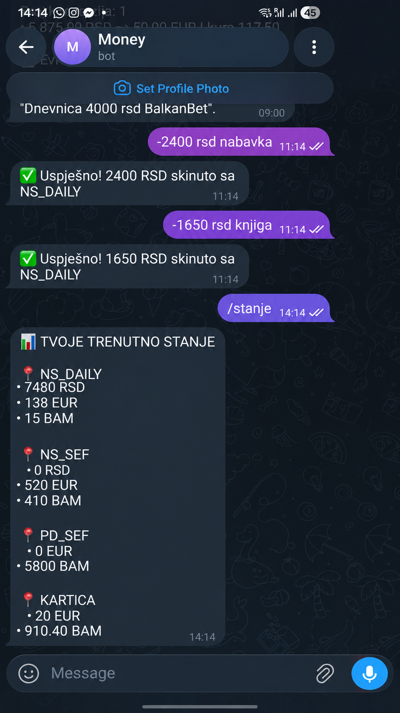
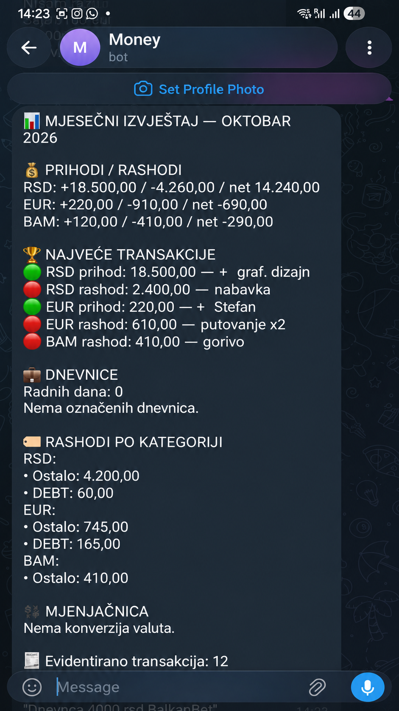
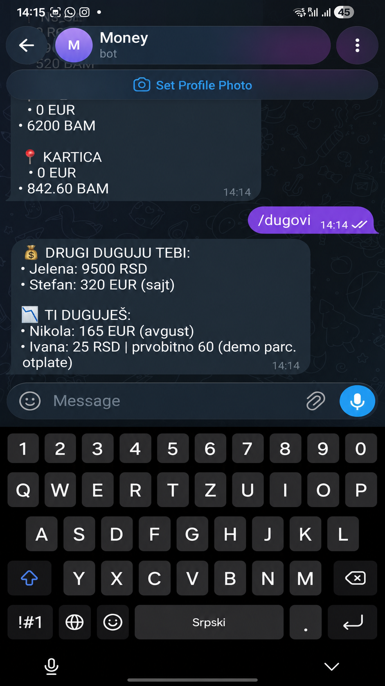
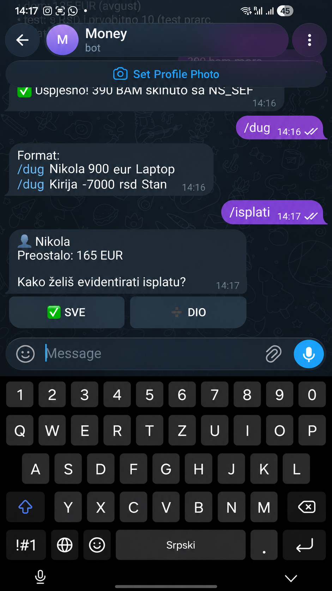

# Money Manager Telegram Bot

A private Telegram-based personal finance system built for a real multi-currency cash workflow.

The project started because generic budgeting apps did not match the way I actually manage physical cash across different currencies and locations. The bot is used directly through Telegram and keeps PostgreSQL/Supabase as the source of truth.

## Tech Stack

- Node.js
- Telegraf
- Supabase
- PostgreSQL
- PostgreSQL RPC functions
- node-cron
- Render
- Node.js built-in test runner

## What it handles

- Income and expenses in RSD, EUR and BAM
- Physical money locations such as a daily wallet and safes
- Transfers between locations
- Currency exchange with real-world returned change
- Effective exchange-rate tracking
- Debts and receivables
- Full and partial debt payments
- Atomic wallet + ledger updates in PostgreSQL
- Daily-wage tracking
- Current and previous-month reports
- Automatic monthly report delivery
- Telegram user whitelist
- Render-compatible health server

## Screenshots

The screenshots below show the real Telegram interface using synthetic demo data.  
No personal financial information is displayed.

| Multi-currency wallets | Monthly report |
|---|---|
|  |  |

| Debt tracking | Partial debt payment |
|---|---|
|  |  |

The screenshots demonstrate:

- **Multi-currency wallets** — RSD, EUR and BAM distributed across physical cash locations.
- **Monthly reporting** — income, expenses, net result, largest transactions and spending categories.
- **Debt tracking** — receivables and liabilities in multiple currencies.
- **Partial repayments** — debts can be partially paid while the remaining amount stays active.

## Real-world exchange example

Instead of assuming that all cash handed to an exchange office was converted, the bot models returned change.

```text
/zamijeni džep dao 12000 rsd dobio 100 eur kusur 200 rsd
```

Result:

```text
Given:              12,000 RSD
Returned change:       200 RSD
Actually exchanged: 11,800 RSD
Received:              100 EUR
Effective rate:        118 RSD/EUR
```

The EUR stays in the same physical wallet first. If it is later placed into a safe, that is recorded as a separate transfer:

```text
/prebaci iz džep u ns sef 100 eur
```

This distinction keeps the digital model aligned with what physically happened to the cash.

## Debt workflow

Create a receivable:

```text
/dug Klijent 500 eur Website
```

Create money you owe:

```text
/dug Faks -6000 rsd Ispiti
```

Then:

```text
/isplati
```

Select the debt and choose either:

- `SVE` for the full remaining amount
- `DIO` for a partial payment

Every payment updates the wallet, transaction ledger, debt remaining amount and debt-payment history in one PostgreSQL transaction.

## Daily wage tracking

```text
Dnevnica 4000 rsd BalkanBet
```

Entries containing `Dnevnica` are categorized for monthly reporting. Reports show the number of recorded work days, total daily-wage income and descriptions of recorded work.

## Reports

Current month:

```text
/izvjestaj
```

Previous month:

```text
/izvjestaj prosli
```

The scheduler sends the completed previous-month report on the first day of each month at 09:00 in the `Europe/Belgrade` timezone.

Currencies are reported separately. RSD, EUR and BAM are never incorrectly added into one total.

## Architecture

```text
Telegram
   |
Telegraf
   |
Command / callback handlers
   |
Service layer
   |
Supabase JS
   |
PostgreSQL RPC functions
   |
wallets / transactions / transfers / debts / debt_payments
```

Financial operations that affect more than one record are handled atomically in PostgreSQL so a wallet balance cannot be changed without the related ledger or debt record being updated in the same operation.

## Database design

The project uses five main finance tables:

- `wallets` — balance by physical location and currency
- `transactions` — income and expense ledger
- `transfers` — transfers between locations and currency conversions
- `debts` — receivables and liabilities
- `debt_payments` — debt payment history

Database changes are tracked through SQL migration files in the `database/` directory.

## Security

- Telegram access is restricted through `ALLOWED_USER_IDS`.
- Secrets live in `.env`, which must never be committed.
- Server-side Supabase access uses the service-role key.
- RLS is enabled on finance tables.
- Atomic write RPC functions are not executable by `anon` or `authenticated`; execution is granted only to `service_role`.

## Environment variables

Create `.env` in the project root:

```text
TELEGRAM_BOT_TOKEN=
ALLOWED_USER_IDS=
SUPABASE_URL=
SUPABASE_SERVICE_ROLE_KEY=
NODE_ENV=production
PORT=3000
```

Never commit the real `.env`.

## Run locally

Install dependencies:

```bash
npm ci
```

Run tests:

```bash
npm test
```

Start the bot:

```bash
npm start
```

Only one polling instance of the Telegram bot may use the same bot token at the same time. Suspend the production Render instance while testing locally.

## Tests

```bash
npm test
```

The automated test suite covers:

- Money-input parsing
- EUR and BAM parsing
- Currency-exchange calculations
- Returned-change calculations
- Invalid exchange scenarios
- Partial debt payment parsing
- Currency validation
- Cancellation handling

## Deployment

The bot is deployed on Render.

Render runs:

```text
Build Command:
npm ci && npm test

Start Command:
npm start
```

The application exposes:

```text
/health
```

for service health checks.

The production bot uses environment variables configured directly in Render. The real `.env` file is never uploaded to GitHub.

## Project structure

```text
finance-bot/
├── database/
│   ├── 001_atomic_finance_operations.sql
│   ├── 002_exchange_hardening.sql
│   ├── 003_partial_debt_payments.sql
│   ├── 004_wallet_seed.sql
│   └── README.md
├── docs/
│   └── images/
│       ├── debts.png
│       ├── monthly-report.png
│       ├── partial-payment.png
│       └── wallet-balances.png
├── src/
│   ├── db/
│   ├── handlers/
│   ├── middleware/
│   ├── services/
│   ├── utils/
│   ├── bot.js
│   └── index.js
├── tests/
├── .env.example
├── .gitignore
├── package.json
├── package-lock.json
└── README.md
```

## Why this project exists

This is not a generic finance-app clone.

It was designed around an actual personal workflow and then improved after real usage exposed edge cases that generic budgeting apps did not handle well:

- Physical wallet locations
- Multiple cash currencies
- Returned exchange-office change
- Moving exchanged cash into a safe later
- Partial debt repayments
- Personal daily-wage tracking
- Monthly reporting through Telegram

The project is both a tool I actively use and a backend-focused portfolio project demonstrating practical problem solving, transactional database design and real-world workflow modeling.
